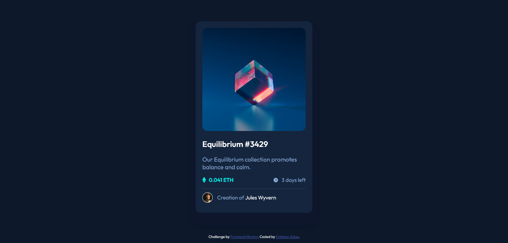

# Frontend Mentor - NFT preview card component solution

This is a solution to the [NFT preview card component challenge on Frontend Mentor](https://www.frontendmentor.io/challenges/nft-preview-card-component-SbdUL_w0U). Frontend Mentor challenges help you improve your coding skills by building realistic projects.

## Table of contents

- [Overview](#overview)
  - [The challenge](#the-challenge)
  - [Screenshot](#screenshot)
  - [Links](#links)
- [My process](#my-process)
  - [Built with](#built-with)
  - [What I learned](#what-i-learned)
  - [Continued development](#continued-development)
- [Author](#author)

## Overview

### The challenge

Users should be able to:

- View the optimal layout depending on their device's screen size
- See hover states for interactive elements

### Screenshot



### Links

- Live Site URL: [https://geo0510.github.io/Cardcomponent.github.io-/]

## My process

### Built with

- Semantic HTML5 markup
- CSS custom properties
- Flexbox

### What I learned

How to use the pseudo-class :hover and practice more with position and flexbox.

```html
<div class="container_moreinfo">
  <p>
    
    <span class="more_info info_new-color">0.041 ETH</span>
  </p>
  <p>
    
    <span class="more_info text-color">3 days left</span>
  </p>
</div>
```

```css
.container_imag {
  position: absolute;
  right: 20px;
  background-color: hsl(178, 100%, 50%);
  width: 310px;
  height: 310px;
  border-radius: 15px;
  opacity: 0;
}

.container_imag-icon {
  position: absolute;
  top: 110px;
  left: 95px;
}
```

### Continued development

I planed to learn about the uses of hover and practice more position of elements.

## Author

- Frontend Mentor - [@Geo0510](https://www.frontendmentor.io/profile/Geo0510)
- Github - [@Geo0510 ](https://github.com/Geo0510)
